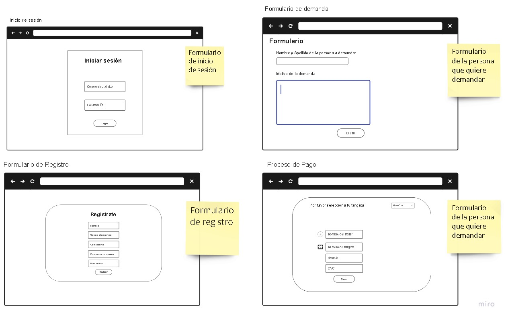

# Abogabot   

## Toma de Requerimientos
La practica consiste en realizar una pagina web para automatizar las demandas en despacho de abogados 

## Practicas 

- Toma de Requerimientos 
- Crea tu Buyer Personal
- Publico Objetivo
- Crear tu primer Wireframe
- Crea tu primer UI

## Buyer Personal 

## Publico Objetivo

## Crea tu primer Wireframe

