# Abogabot   

## Toma de Requerimientos
La practica consiste en realizar una pagina web para automatizar las demandas en un  despacho de abogados 

***Cliente***
- El cliente entra al sitio web
- Completa el formulario para demandar
- Crea una cuenta
- Completa el pago
- Visualiza el seguimiento de su demanda

***Administrador***
- Inicia sesion con su cuenta de abogado
- Recibe notificacion de la demanda
- Recibe notificacion sobre el pago
- Visualiza la cantidad de ingreso sobre la demanda
- Actualiza el seguimiento de la demanda y agrega comentarios 

## Practicas 

- Toma de Requerimientos 
- Crea tu Buyer Personal
- Publico Objetivo
- Crear tu primer Wireframe
- Crea tu primer UI

## Buyer Personal 
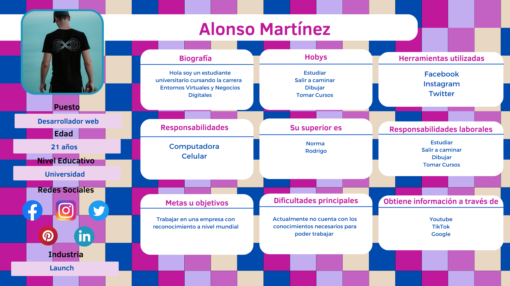

## Publico Objetivo
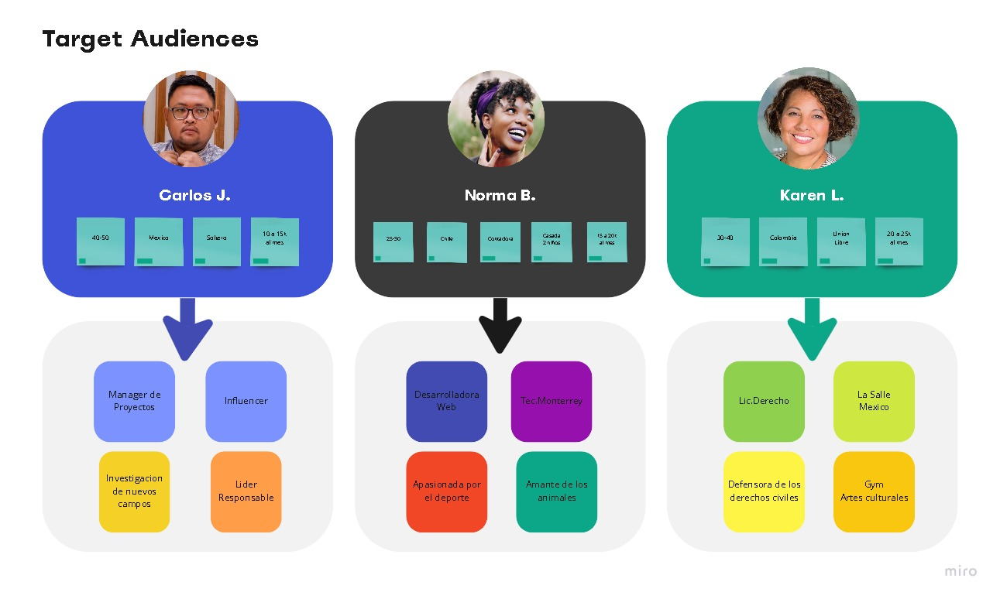

## Crea tu primer Wireframe

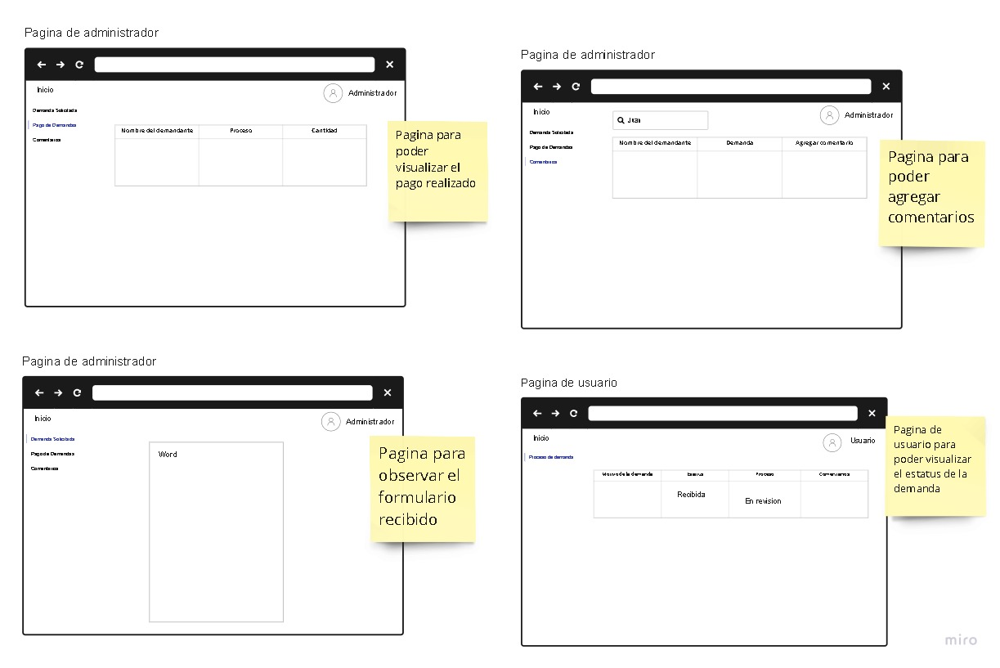

## UI 
Inicio
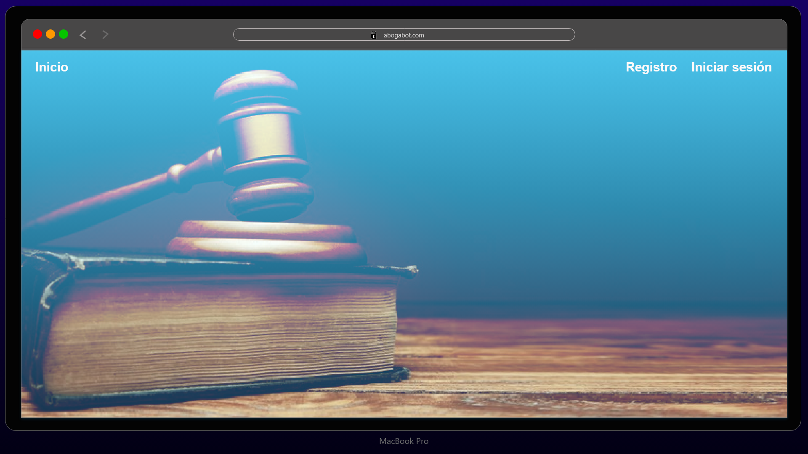
Formulario del demandante
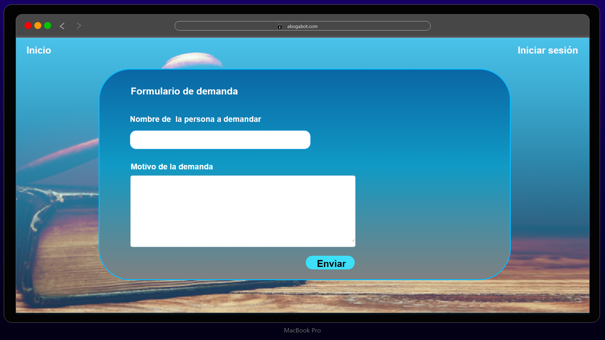
Registro de usuario
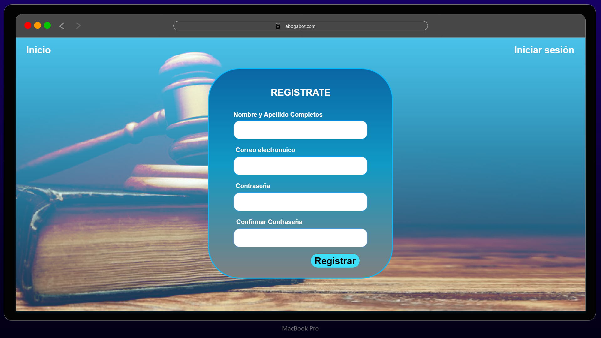
Inicio de sesión
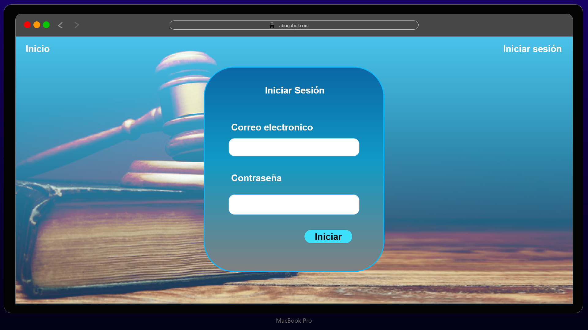
Proceso de pago
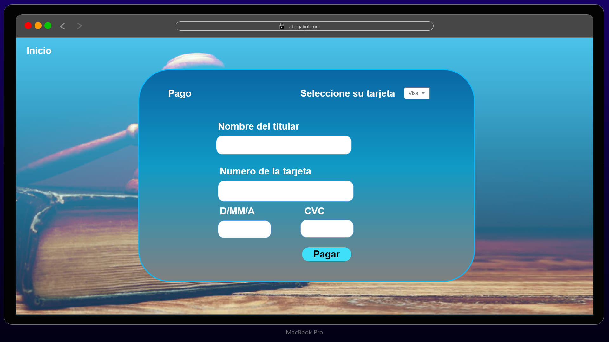
Pagina de visualizacio de la demanda del usuario
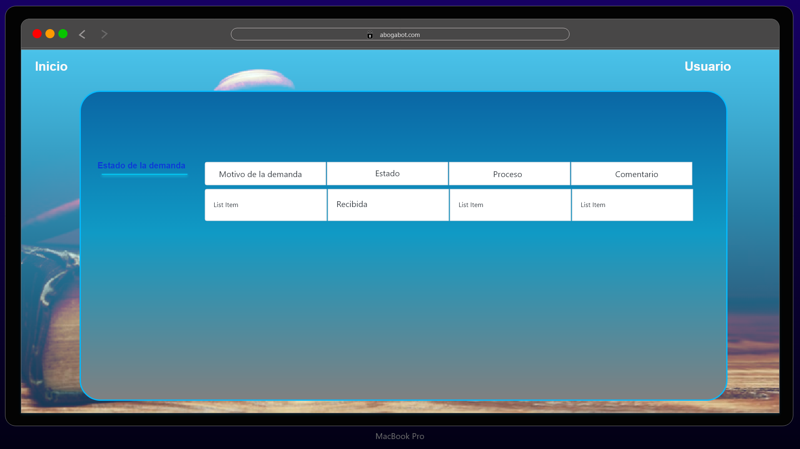
Pagina del Administrador
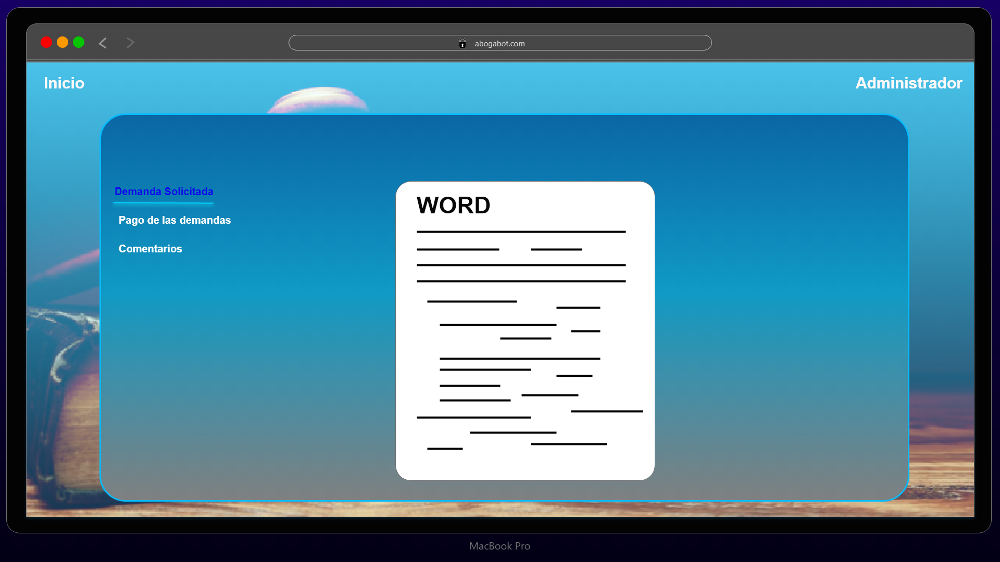
Pagina para visualizar los pagos del demandante
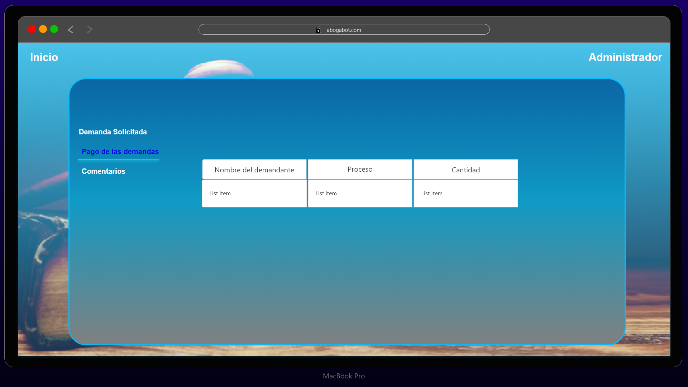
Pagina para actualizar el proceso de la demanda
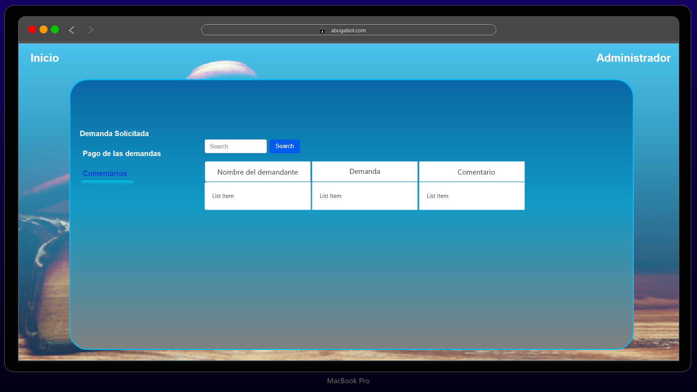

